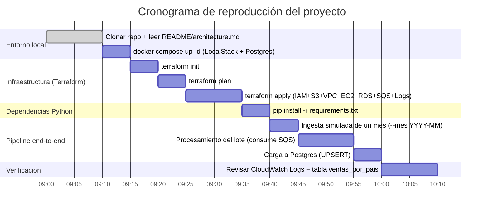

# Arquitectura — DataLake Pipeline AWS

## Diagrama

​```mermaid
flowchart LR
    KAGGLE["Dataset Kaggle<br/>(origen simulado)"] -->|"upload mensual"| RAW
    RAW -.->|"aviso de lote nuevo"| SQS["SQS: datalake-lotes-pendientes"]

    subgraph S3["S3 — datalake-ventas"]
        RAW["raw/sales/ingest_date=YYYY-MM/"]
        PROC["processed/"]
        CUR["curated/"]
    end

    subgraph VPC["VPC 10.0.0.0/16"]
        subgraph PRIV["Subred privada"]
            EC2["EC2 + Auto Scaling"]
            EP["VPC Endpoint → S3"]
        end
    end

    SQS -->|"consume lote"| EC2
    EC2 --> EP --> S3
    EC2 --> PROC
    EC2 --> CUR
    EC2 -->|"put_log_events"| CWL["CloudWatch Logs: /datalake/batch"]
    CUR -->|"UPSERT"| RDS["RDS PostgreSQL"]

    IAM["IAM: batch-role<br/>(min. privilegio por prefijo)"] -.->|"rol asumido"| EC2
​```

## Componentes

| Componente local | Equivalente cloud | Identidad / credencial |
|---|---|---|
| LocalStack IAM (`batch-role`) | AWS IAM Role | `sts:AssumeRole`, credenciales temporales (15 min) |
| LocalStack S3 (`datalake-ventas`) | Amazon S3 | Acceso vía `batch-role` + bucket policy (dos capas) |
| Terraform (`iac/`) | Terraform contra AWS real | Local: `test`/`test`. Prod: credenciales reales, sin hardcodear |
| EC2 + Auto Scaling | Amazon EC2 + Auto Scaling Group | Instance profile → `batch-role`, sin access keys en la instancia |
| VPC | Amazon VPC | Subred privada + Security Groups referenciados entre sí |
| RDS | Amazon RDS PostgreSQL | Credencial en Secrets Manager, leída en runtime |
| SQS (`datalake-lotes-pendientes`) | Amazon SQS | Acceso vía `batch-role`, acotado a la cola por ARN |
| CloudWatch Logs (`/datalake/batch`) | Amazon CloudWatch Logs | Acceso vía `batch-role`, solo `CreateLogStream`/`PutLogEvents` sobre ese log group |

## Puntos únicos de falla identificados

| SPOF | Mitigación en cloud |
|---|---|
| Una sola instancia EC2 fija, sin Auto Scaling (ADR 006: `autoscaling` es feature paga en LocalStack Community) | Auto Scaling Group real (min=0, max=2) con health checks, ya diseñado como versión de producción en el ADR |
| Postgres en un único contenedor Docker, sin réplica (ADR 008: RDS es feature paga en LocalStack Community) | Amazon RDS Multi-AZ con failover automático y backups gestionados |
| Subred privada única en una sola AZ (`us-east-1b`) | Subredes privadas espejadas en al menos 2 AZ, con el ASG distribuyendo instancias entre ellas |
| Un solo VPC Endpoint Gateway a S3 | Los VPC Endpoint Gateway ya son redundantes por diseño de AWS a nivel de región; no requiere mitigación adicional |
| LocalStack como único backend del entorno local (ADR 004: perder el contenedor borra todo el estado in-memory) | No aplica en AWS real — cada servicio (IAM, S3, EC2, SQS, etc.) es gestionado y redundante por AWS, esto es una limitación exclusiva del entorno local de desarrollo |

## Estimación de costos (AWS real, us-east-1)

Todo lo que corre en este proyecto es gratis porque vive en LocalStack. Esta es una
estimación de lo que costaría el mismo diseño corriendo contra AWS real, a precio
de lista on-demand (sin Free Tier, sin Reserved/Savings Plans), para dimensionar
el orden de magnitud — no reemplaza a la AWS Pricing Calculator.

| Servicio | Precio de referencia | Supuesto de uso | Estimado / mes |
|---|---|---|---|
| EC2 `t3.micro` | $0.0104 / hora | Instancia prendida 24/7 (730 hs) | ~$7.60 |
| EBS root volume (8 GB gp3, va con la EC2) | ~$0.08 / GB-mes | 8 GB provisionados todo el mes | ~$0.65 |
| RDS `db.t3.micro` PostgreSQL (Single-AZ) | $0.018 / hora | Instancia prendida 24/7 (730 hs) | ~$13.15 |
| RDS storage (gp2, 20 GB mínimo) | ~$0.115 / GB-mes | 20 GB provisionados todo el mes | ~$2.30 |
| S3 Standard (`datalake-ventas`) | ~$0.023 / GB-mes + requests | Dataset del proyecto (< 1 GB), pocas decenas de PUT/GET al mes | < $0.05 |
| VPC Endpoint Gateway → S3 | Sin costo | Los Gateway endpoints no cobran por hora ni por datos | $0.00 |
| Secrets Manager | $0.40 / secreto / mes + $0.05 / 10k llamadas | 1 secreto (`app/db`), pocas decenas de `get_secret_value` al mes | ~$0.40 |
| SQS (`datalake-lotes-pendientes`) | $0.40 / millón de requests | Decenas de mensajes al mes (dentro del free tier de 1M) | $0.00 |
| CloudWatch Logs (`/datalake/batch`) | $0.50 / GB ingerido + $0.03 / GB-mes almacenado | Unos pocos MB de log por corrida | < $0.05 |
| **Total aproximado** | | Todo prendido 24/7 todo el mes | **~$24 / mes** |

Si en vez de dejar todo prendido se usa solo para correr el pipeline unas horas
por semana (que es como se probó este proyecto) y se hace `terraform destroy`
entre sesiones — posible porque, según el ADR 004, `terraform apply` reconstruye
todo desde cero sin intervención manual — el costo baja a lo que queda
provisionado aunque la EC2/RDS estén apagadas (storage: RDS + EBS, ~$3/mes) más
centavos de cómputo por las horas reales de uso.

Nota: precios de lista para `us-east-1`, consultados en instances.vantage.sh
(EC2/RDS) y documentación pública de AWS (S3/SQS/CloudWatch Logs/Secrets
Manager) en agosto 2026. Pueden variar por región y cambian con el tiempo —
para un número exacto usar la AWS Pricing Calculator.

## Decisiones de identidad

- Los servicios se autentican entre sí sólo con roles IAM asumidos vía STS — nunca con access keys de larga duración guardadas en algún lado.
- `batch-role` es la única identidad con acceso al bucket, y el acceso está acotado por prefijo: sólo lee `raw/`, lee y escribe `processed/` y `curated/`, no puede borrar nada en ningún lado.
- Las credenciales que devuelve `assume-role` expiran a los 15 minutos — en AWS real esto lo renueva solo el servicio (EC2 vía IMDSv2), nadie las toca a mano.
- La credencial de RDS vive en Secrets Manager, nunca en el código ni en variables de entorno commiteadas.
- El acceso a la cola SQS y al log group de CloudWatch está acotado por ARN en la misma policy de `batch-role`, no son permisos nuevos por fuera del modelo de mínimo privilegio.

## Cronograma

Estimación de tiempos para reproducir este proyecto desde cero, siguiendo los
pasos de ["Cómo correrlo end-to-end"](../README.md#cómo-correrlo-end-to-end)
del README. Pensado para alguien que clona el repo y no tiene nada corriendo
todavía — no son fechas de calendario, son duraciones relativas al arranque.



Total estimado: **~70 minutos** para tener el pipeline completo corriendo una
vez, de punta a punta, en una máquina nueva. Repetir solo la sección "Pipeline
end-to-end" para meses adicionales toma ~20 minutos (no hace falta rehacer
`terraform apply` salvo que se haya perdido el estado de LocalStack, ver ADR 004).